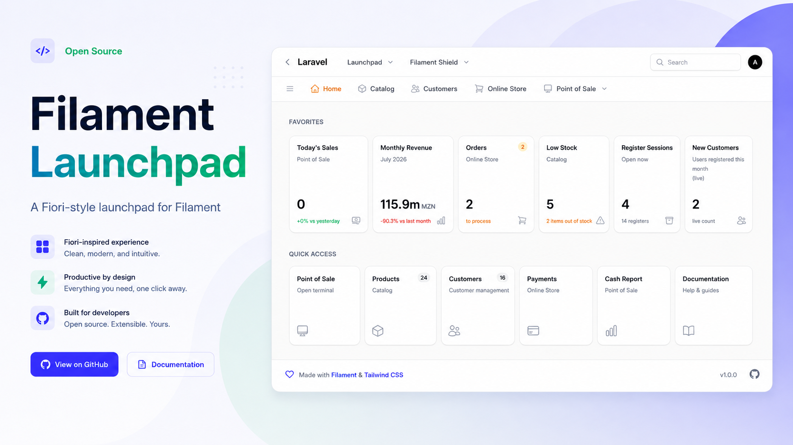
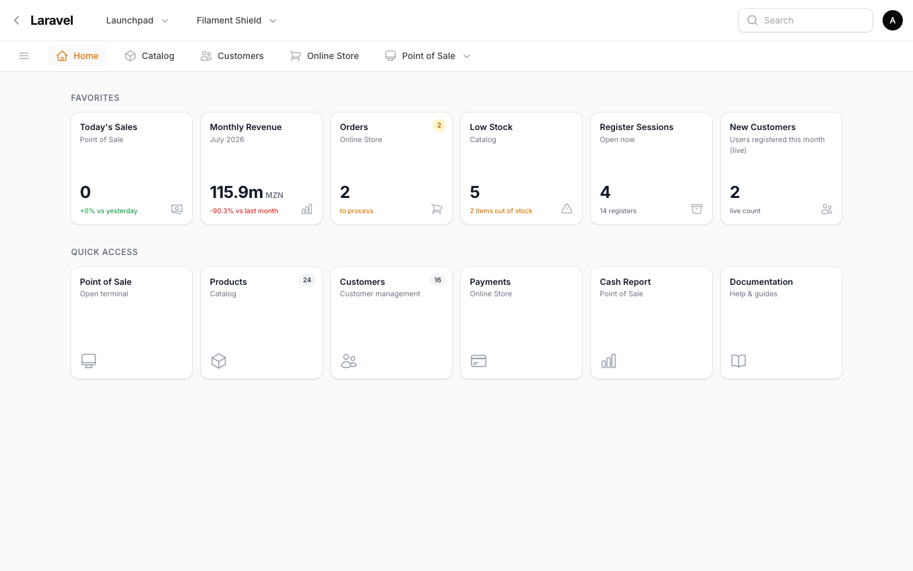
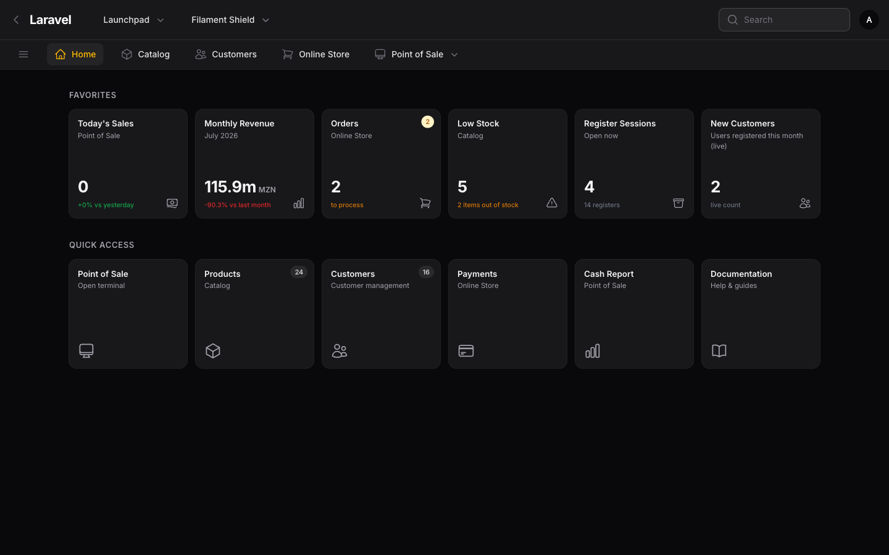
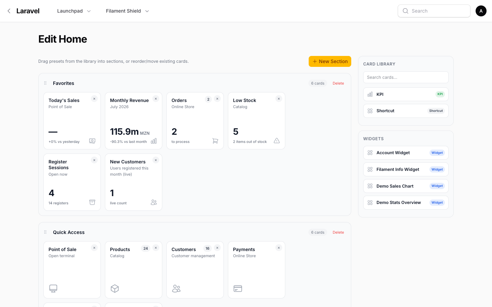
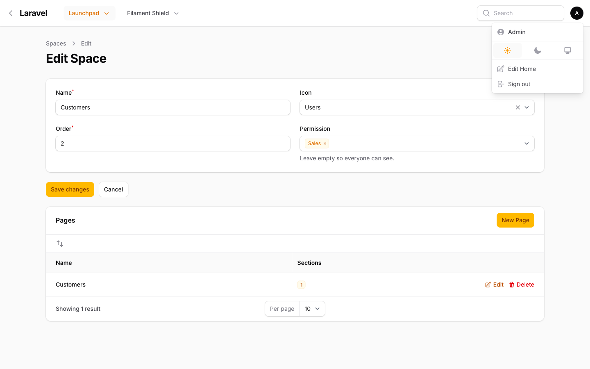
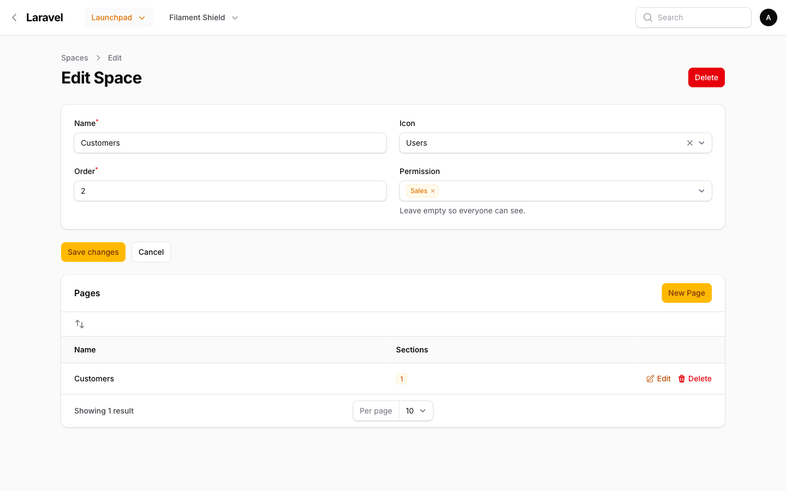
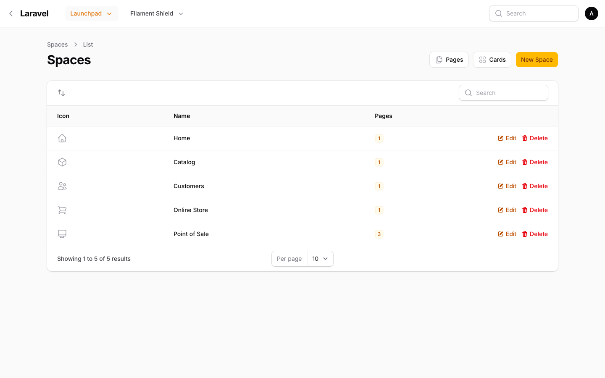
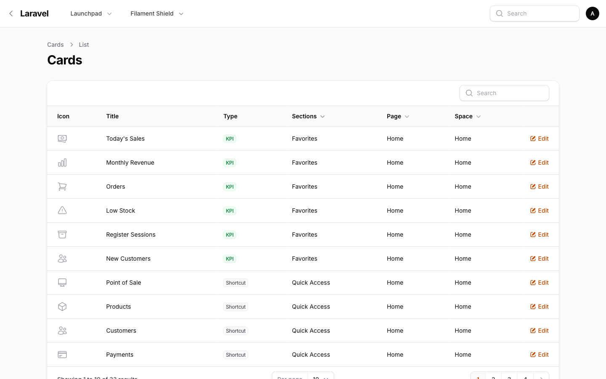
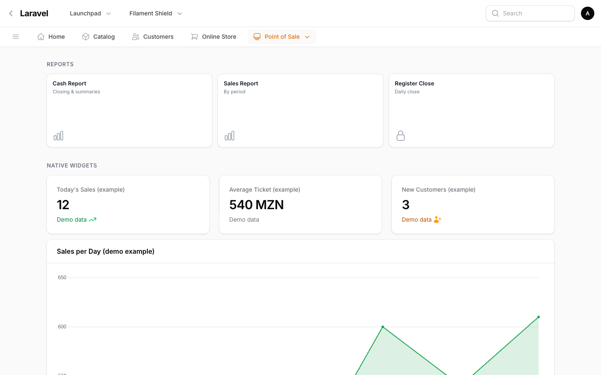

# Filament Launchpad

[](https://packagist.org/packages/anselmocossa/filament-launchpad)
[](https://packagist.org/packages/anselmocossa/filament-launchpad)
[](LICENSE.md)



Turn your Filament panel's homepage into a SAP Fiori-style launchpad: Spaces, Pages, Sections and drag-and-drop KPI/shortcut/widget cards, with role-based visibility and a full builder UI — all rendered inside the native Filament shell.

## Screenshots


*The launchpad home page in light mode: sub-nav tabs, sections and tile cards.*


*The same home page in dark mode — panel chrome (topbar, sidebar) stays native.*


*The layout builder: drag cards from the library or existing sections to rearrange the page.*


*"Edit Home" in the account/user menu — a one-click shortcut into the builder for the home page.*


*The "Permission" field on a Space/Page/Section/Card, restricting visibility to selected roles.*


*Managing Spaces, Pages and Sections through the plugin's Resources.*


*The flat Cards index, also reachable from Filament's global search.*


*A native Filament widget (StatsOverviewWidget/ChartWidget) rendered in place of a card.*

## Features

- **Fiori-style launchpad home page** — sub-nav tabs, grouped sections, and a grid of clickable cards, rendered inside the native Filament page shell (topbar, sidebar, breadcrumbs and dark mode stay untouched).
- **Space → Page → Section → Card hierarchy** — manage everything through dedicated Filament Resources and nested relation managers.
- **Sub-nav navigation** — "☰ All Spaces" menu, a per-space Pages dropdown, and an automatic "More ▾" overflow (priority-nav) so the tab bar never scrolls.
- **Three card types** — KPI (live value via a registered source), Shortcut (link to a Resource, Page or URL), and Widget (renders a native `StatsOverviewWidget`/`ChartWidget` in place of the card).
- **Safe KPI sources** — closures registered by the developer, never `eval`'d, never user-controlled. A throwing source degrades the tile to `—` instead of breaking the page.
- **Reusable card library** — draggable presets for the builder, defined once and dropped into as many sections as needed.
- **Auto-discovered widget library** — widgets already registered on the panel are available in the builder out of the box; override label/icon/column span or add extra ones only when needed.
- **Drag-and-drop layout builder** — native HTML5 Drag and Drop (Alpine-driven, no external JS library), with a searchable Card Library and Widgets panel.
- **"Edit Home" shortcut** — a one-click entry in the account/user menu straight into the builder for the home page, without navigating the Spaces/Pages tree.
- **Global search** — Cards are searchable from Filament's built-in global search, with the Section/Page/Space they live in shown as result details.
- **Role-based visibility (Fiori-style permissions)** — a "Permission" field on every Space/Page/Section/Card, softly integrated with `bezhansalleh/filament-shield` and `spatie/laravel-permission`.
- **Localization** — English, European Portuguese, Brazilian Portuguese and generic Portuguese translations included, fully overridable.

## Requirements

- PHP 8.2+
- Filament 5.0+ (4.0+ also supported)
- Laravel (Illuminate contracts/support) 11.0+, 12.0+, or 13.0+

## Installation

Install the package via Composer:

```bash
composer require anselmocossa/filament-launchpad
```

Run the installer — it publishes the config and migrations, then optionally runs them:

```bash
php artisan launchpad:install          # publish config + migrations
php artisan launchpad:install --migrate # …and run the migrations (asks first)
```

Prefer to do it by hand? Run the migrations (Spaces, Pages, Sections, Cards and the role-visibility pivot) yourself:

```bash
php artisan migrate
```

Optionally publish the config file, views or translations:

```bash
php artisan vendor:publish --tag="launchpad-config"
php artisan vendor:publish --tag="launchpad-views"
php artisan vendor:publish --tag="launchpad-lang"
```

Register the plugin in your panel provider:

```php
use Filament\Launchpad\LaunchpadPlugin;

public function panel(Panel $panel): Panel
{
    return $panel
        // ...
        ->plugin(LaunchpadPlugin::make());
}
```

The plugin registers a `Launchpad` page at the panel root (`/`), so it becomes the panel home. If your panel also registers the default `Dashboard` page, remove it (or give it another slug) so the launchpad can own `/`.

After installing, build the launchpad from the UI: create a Space, a Page inside it, a Section inside that, and Cards inside the Section — or use the drag-and-drop builder (see below) instead of the plain forms.

## Usage

### Spaces, Pages, Sections and Cards

The launchpad is database-driven by default. The hierarchy is:

- **Space** — a top-level entry in the sub-nav. A Space with a single Page renders as a plain button; with several Pages it shows a dropdown.
- **Page** — lives inside a Space and holds Sections. Selecting a Page swaps which Sections render.
- **Section** — a titled group of Cards on a Page.
- **Card** — a single tile: KPI, Shortcut, or Widget.

Manage all four through the plugin's Filament Resources (**Spaces**, reachable from the sidebar; **Pages**, **Sections** and **Cards** reachable through relation managers and the "Pages"/"Cards" header buttons), or build a Page visually with the drag-and-drop builder.

### KPI sources

Register named, closure-based KPI sources on the plugin — never raw strings, never `eval`, always a callable the developer controls:

```php
use Filament\Launchpad\LaunchpadPlugin;

LaunchpadPlugin::make()->kpiSources([
    'sales_today' => fn () => Sale::whereDate('created_at', today())->count(),
    'open_tickets' => fn () => Ticket::whereNull('resolved_at')->count(),
]);
```

A KPI Card then references a source by its key (from the "Source (Live)" select in the Card form) instead of embedding logic — if the closure throws, the tile degrades to `—` rather than breaking the page. A Card without a source can instead use a "Fixed Value" typed directly into the form.

### Card library

Register presets that show up in the builder's "Card Library" panel, ready to be dragged into any Section:

```php
LaunchpadPlugin::make()->cardLibrary([
    [
        'key' => 'sales-today',
        'title' => 'Sales Today',
        'icon' => 'heroicon-o-banknotes',
        'type' => 'kpi',
        'subtitle' => 'Point of Sale',
        'kpi_value' => null,
        'unit' => null,
        'trend' => null,
        'badge' => null,
        'target_type' => 'url',
        'target_value' => '/admin/sales',
    ],
]);
```

Presets are reusable — dropping the same preset into several Sections is expected; wire a `kpi_source` (or edit the value) on the created Card afterwards.

### Widgets

Any widget already registered on the panel through `widgets()` or `discoverWidgets()` is automatically available in the builder's "Widgets" library. Use `widgets()` on the plugin only to override the generated label/icon/column span, or to expose a widget that is not registered on the panel:

```php
use App\Filament\Widgets\RevenueChart;
use Filament\Launchpad\LaunchpadPlugin;

LaunchpadPlugin::make()->widgets([
    [
        'key' => 'revenue-chart',
        'class' => RevenueChart::class,
        'label' => 'Revenue',
        'icon' => 'heroicon-o-chart-bar',
        'columnSpan' => 'full',
    ],
]);
```

Dropping a widget from the library creates a Card of type `widget` that stores only its registered `key` — the class is resolved from the developer's registration at render time, never read from the database directly.

### Drag-and-drop builder

Open the builder from a Page's **Build** action (Spaces → a Space → Pages → a Page), or jump straight to the home page's builder via **Edit Home** in the account/user menu. From there you can:

- Add, rename, reorder and delete Sections.
- Drag a preset from the Card Library, or a widget from the Widgets panel, into any Section.
- Drag existing Cards between Sections, or reorder them within a Section.
- Click a Card to edit it in place (same form used by the Cards relation manager).

### Global search

Cards are registered as globally searchable (by title and subtitle) through Filament's built-in global search. A result shows which Section/Page/Space the Card lives in, and navigates to whatever the Card's target resolves to.

## Configuration

The published config file (`config/launchpad.php`) exposes `branding`, `accent_color`, `dark_header`, and `tile_sizing`:

```php
return [
    'branding' => [
        'name' => 'Launchpad',
        'logo' => null,
    ],
    'accent_color' => '#16a34a',
    'dark_header' => false,
    'tile_sizing' => 'fluid', // 'fixed' (6 equal columns, 1/6 row width each) or 'fluid' (auto-fit, minmax 176px)
];
```

- **`fixed`**: `repeat(6, 1fr)` — always 6 equal columns, each card exactly 1/6 of row width, no empty space, no stretching.
- **`fluid`**: `auto-fit minmax(176px, 1fr)` — tiles stretch equally to fill the row, more tiles per row on wider screens.

Both modes use `auto-fit` so empty grid tracks collapse when fewer tiles than columns.

Prefer the fluent plugin API for anything beyond these — `LaunchpadPlugin::make()->accentColor('#16a34a')->tileSizing('fixed')` — since the config file cannot express closures (live KPIs, widget mappings).

## Permissions & Shield

Every Space, Page, Section and Card has a **Permission** field: the roles allowed to see it. Leave it empty and everyone can see the item — this is the default, unrestricted behaviour, with no dependency required.

Install [`bezhansalleh/filament-shield`](https://filamentphp.com/plugins/bezhansalleh-shield) (which pulls in `spatie/laravel-permission`) to turn the field into an active gate:

```bash
composer require bezhansalleh/filament-shield spatie/laravel-permission
php artisan shield:install
```

Once installed:

- A Space/Page/Section/Card restricted to one or more roles is hidden from any user who does not hold at least one of them — cascading down the hierarchy (an empty Space, Page or Section, once everything inside it is filtered out, is hidden too).
- The Shield `super_admin` role always sees everything, regardless of restrictions.
- The `Launchpad` (home) and `EditHome` pages are themselves gated (`View:Launchpad`, `View:EditHome`), and the Spaces/Pages/Sections/Cards Resources ship their own policies — Shield's convention-based policy discovery does not reach models under `Filament\Launchpad\Models\*`, so the plugin registers these policies itself.
- A restricted Card is also excluded from Filament's global search results for users without the role.

Without `spatie/laravel-permission` installed, none of the above applies: the "Permission" field is simply not rendered, and every ability is granted.

## Localization

Translation catalogs are included for:

- English (`en`) — base language
- Portuguese (`pt`)
- European Portuguese (`pt_PT`)
- Brazilian Portuguese (`pt_BR`)

Publish and override the translation files with:

```bash
php artisan vendor:publish --tag="launchpad-lang"
```

Then edit `resources/lang/vendor/launchpad/{locale}/launchpad.php` — every string in the plugin (labels, buttons, builder copy, model names) is wrapped in `__('launchpad::launchpad.*')`, so any published locale immediately overrides the package default.

## Testing

```bash
composer test
```

## Changelog

Please see [CHANGELOG](CHANGELOG.md) for more information on what has changed recently.

## Contributing

Issues and pull requests are welcome. Please run `composer lint` and `composer test` before submitting a PR, and keep new strings translatable via `launchpad::launchpad.*`.

## Security Vulnerabilities

If you discover any security-related issues, please email anselmo.cossa@enh.co.mz instead of using the issue tracker.

## Credits

- [Anselmo Cossa](https://github.com/anselmocossa)

## License

The MIT License (MIT). Please see [License File](LICENSE.md) for more information.
